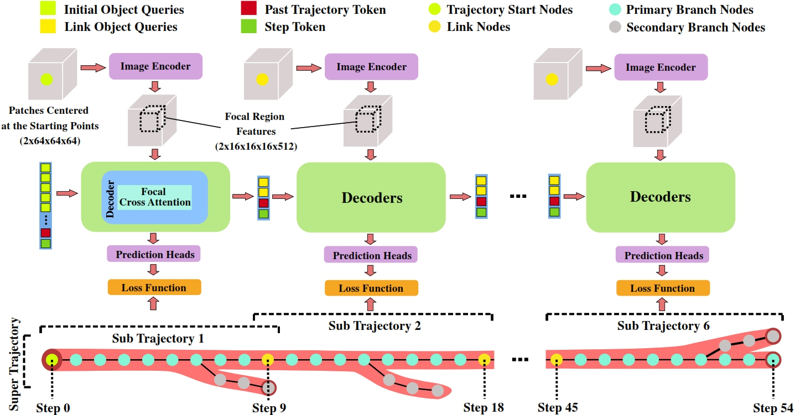

# Trexplorer Super: Topologically Correct Centerline Tree Tracking of Tubular Objects in CT Volumes

This repository provides the official implementation of the [Trexplorer Super: Topologically Correct Centerline Tree Tracking of Tubular Objects in CT Volumes](https://arxiv.org/abs/2507.10881) paper by [Roman Naeem](https://research.chalmers.se/en/person/nroman), [David Hagerman](https://research.chalmers.se/en/person/olzond), [Jennifer Alvén](https://research.chalmers.se/person/alven), [Lennart Svensson](https://research.chalmers.se/person/pale) and [Fredrik Kahl](https://research.chalmers.se/person/kahlf). The codebase builds upon [Trexplorer](https://github.com/RomStriker/Trexplorer).

<div align="center">
    
</div>

## Abstract

Tubular tree structures, such as blood vessels and airways, are essential in human anatomy and accurately tracking them while preserving their topology is crucial for various downstream tasks. Trexplorer is a recurrent model designed for centerline tracking in 3D medical images but it struggles with predicting duplicate branches and terminating tracking prematurely. To address these issues, we present Trexplorer Super, an enhanced version that notably improves performance through novel advancements. However, evaluating centerline tracking models is challenging due to the lack of public datasets. To enable thorough evaluation, we develop three centerline datasets, one synthetic and two real, each with increasing difficulty. Using these datasets, we conduct a comprehensive evaluation of existing state-of-the-art (SOTA) models and compare them with our approach. Trexplorer Super outperforms previous SOTA models on every dataset. Our results also highlight that strong performance on synthetic data does not necessarily translate to real datasets.

## Installation
1. Clone this repository:
    ```
    git clone https://github.com/RomStriker/Trexplorer-Super.git
    ``` 
2. Install requirements:
    ```
    pip install -r requirements.txt
    ```
3. Install PyTorch 2.2 with CUDA 11.8:
    ```
    pip install torch==2.2.0 torchvision==0.17.0 torchaudio==2.2.0 --index-url https://download.pytorch.org/whl/cu118
    ```

## Training

### Data Preparation
1. Download the desired [datasets](https://zenodo.org/records/15888958) to `./Trexplorer/data`.
2. For ATM'22 and Parse 2022 only centerline graphs are provided. Download the images and segmentation masks from [ATM'22](https://atm22.grand-challenge.org/) and [Parse 2022](https://parse2022.grand-challenge.org/) and resample them to 0.5 mm isotropically.
3. Run the `./src/trxsuper/datasets/utils/organize_data.py` script to organize the data into the required directory structure.
4. Run the script `./src/trxsuper/datasets/utils/generate_val_sub_vol_file.py` to generate 'annots_val_sub_vol.pickle' file that contains the information about annotations for the validation sub-volume images. 
5. Running the scripts above should give you the following data directory structure:
    ```
    Trexplorer-Super
    ├── data
    │   ├── dataset_name
    │   │   ├── annots_train
    │   │   ├── annots_val
    │   │   ├── annots_val_sub_vol
    │   │   ├── annots_test 
    │   │   ├── images_train
    │   │   ├── images_val
    │   │   ├── images_val_sub_vol
    │   │   ├── images_test
    │   │   ├── masks_train
    │   │   ├── masks_val
    │   │   ├── masks_val_sub_vol
    │   │   ├── masks_test
    │   │   ├── annots_val_sub_vol.pickle
    ```
   The '_train', '_val', and '_test' directories contain the training, validation, and test images respectively. The '_val_sub_vol' directory contains the validation images that are used for patch-level evaluation. The 'masks' directories contain the binary masks of the vessel trees. The 'annots' directories contain the annotation files in the required format.

### Training
The training script uses the configuration file `./configs/train.yaml` to set the hyperparameters. To train the model, run the following command from the root directory:
```
python ./src/train_trx.py
```
For distributed training, use the following command:
```
python -m torch.distributed.launch --nproc_per_node=NUM_GPUS ./src/train_trx.py
```

## Evaluation
For evaluation, in addition to `./configs/train.yaml`, we use  `./configs/eval.yaml`. To evaluate the model, run the following command from the root directory:
```
python ./src/train_trx.py with eval
```
For distributed training, use the following command:
```
python -m torch.distributed.launch --nproc_per_node=NUM_GPUS ./src/train_trx.py with eval
```

## Publication
If you use this software in your research, please cite our publication:

```
@misc{naeem2025trexplorersupertopologicallycorrect,
      title={Trexplorer Super: Topologically Correct Centerline Tree Tracking of Tubular Objects in CT Volumes}, 
      author={Roman Naeem and David Hagerman and Jennifer Alvén and Lennart Svensson and Fredrik Kahl},
      year={2025},
      eprint={2507.10881},
      archivePrefix={arXiv},
      primaryClass={cs.CV},
      url={https://arxiv.org/abs/2507.10881}, 
}
```
